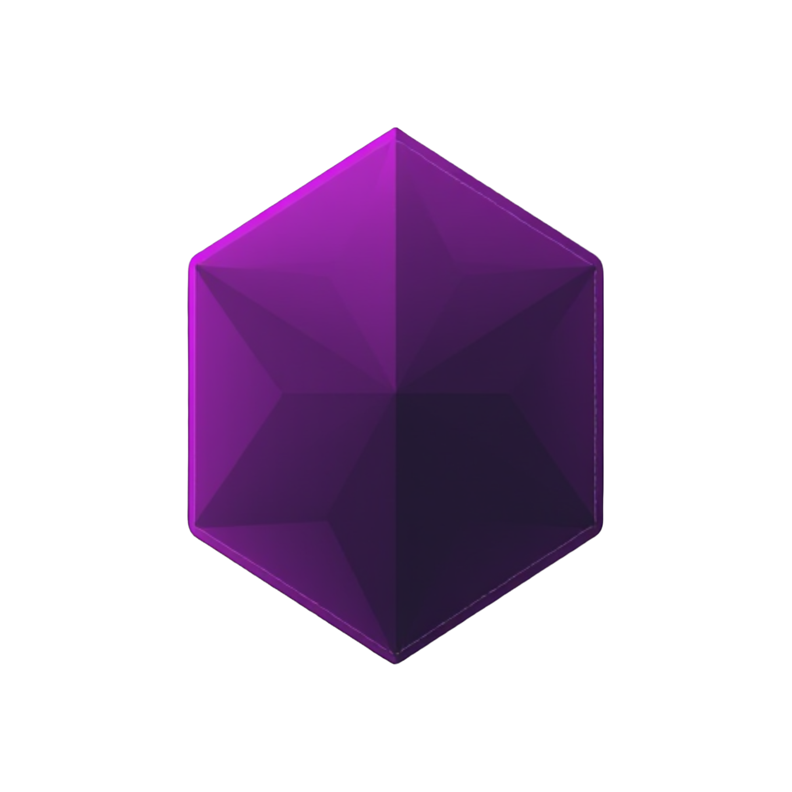

<div align="center">
  
  <h1>Inzex Forensics</h1>
  <p><b>Autonomous Digital Forensics & Incident Response (DFIR) Platform</b></p>
  <p>Built for the <strong>AMD Developer Hackathon (Unicorn Track)</strong></p>
</div>

---

## 🏆 Hackathon Context & Strategy
Inzex Forensics is an AI-gated memory forensics platform targeting B2B SaaS for cybersecurity consultants and Managed Service Providers (MSPs). 

This project was specifically engineered to meet the requirements of **Track 3 (Unicorn)** and target the **$2,000 Best AMD-Hosted Gemma Project Bounty**.

### Meeting the AMD Compute Mandate
To satisfy the automated pre-screening criteria, our architecture strictly relies on the **AMD Developer Cloud (ROCm 7.2 + vLLM 0.16.0 + PyTorch 2.9)** for heavy computation.

The Next.js frontend and Supabase database act as permanent, persistent cloud infrastructure. The AMD ROCm instance runs a **synchronous FastAPI server** that accepts memory dump uploads, runs Volatility 3, inferences Gemma 4, and writes only the structured findings back to Supabase — raw evidence never leaves the AMD environment.

> **🔒 Evidence Privacy Guarantee**
> Raw memory dumps are processed in an isolated temp directory on the AMD instance and are permanently deleted immediately after Volatility 3 completes. Only the structured findings JSON is persisted to Supabase.

---

## 🏗️ The Decoupled Unicorn Architecture

Our architecture bridges large memory dump handling, AMD accelerated computational forensics, and real-time human review.

```text
┌─────────────────────────────────────────────────────────────────────────┐
│                           CLIENT TIER (NEXT.JS)                         │
│   UI: Server-Side Rendered Dashboard (Dark Mode / Cyberpunk Aesthetic)  │
│   Features: Direct .vmem Upload, Human Review Workspace, PDF Report     │
└──────┬─────────────────────────────────────────────────────────▲────────┘
       │ 1. POST /analyze                                         │ 4. Reads findings
       │    multipart .vmem + case metadata                       │    from Supabase
       │    (direct to AMD — no Supabase Storage)                 │    to populate
       ▼                                                          │    workspace UI
┌─────────────────────────────────────────────────────────────────────────┐
│      🔥 THE UNICORN ENGINE (AMD DEVELOPER CLOUD — ROCm FastAPI) 🔥      │
│                                                                         │
│  [1] Save .vmem  →  temp dir (isolated, never uploaded to any cloud)    │
│  [2] Volatility 3 (CPU): pslist → netscan → malfind → cmdline           │
│  [3] os.unlink() — temp file deleted IMMEDIATELY after plugins finish   │
│  [4] Gemma 4 8B (ROCm GPU via vLLM): structured JSON threat report      │
│  [5] Write findings JSON to Supabase cases/findings tables              │
│  [6] Return { case_id } to frontend → redirect to workspace             │
│                                                                         │
│  Endpoints:  POST /analyze   GET /status/{case_id}   GET /health        │
└──────────────────────────────────────────────────────────┬──────────────┘
                                                           │ 3. Writes structured
                                                           │    findings JSON only
                                                           ▼
┌─────────────────────────────────────────────────────────────────────────┐
│                      STATE TIER (SUPABASE)                               │
│  DB Tables: cases, evidence, findings (status, human_feedback)          │
│  NO storage bucket — raw evidence never persisted here                  │
└─────────────────────────────────────────────────────────────────────────┘
```

**Raw evidence never leaves the AMD processing environment. Files are processed in an isolated temp directory and permanently deleted after analysis. Only the structured findings report is persisted.**

---

## 🧠 Gemma 4 on ROCm (The Inference Engine)

To fulfill the requirements for the Gemma Bounty, **Gemma 4 is hosted locally on the AMD hardware**, rather than relying on a cloud API. 

The Python worker node extracts malicious artifacts from raw memory dumps using Volatility 3 (CPU bounded), and then pipes the raw hex/terminal output directly into the locally hosted Gemma 4 model (GPU bounded). The AI agent evaluates the evidence and outputs a highly confident, structured JSON report mapped to the MITRE ATT&CK framework.

### AMD Compute Evidence (vLLM on ROCm)
Below is the core snippet demonstrating how the backend initializes Gemma 4 natively on the AMD hardware using the ROCm-optimized vLLM server:

```python
import asyncio
from vllm import AsyncLLMEngine, AsyncEngineArgs

# Initialize Gemma 4 natively on AMD ROCm hardware
engine_args = AsyncEngineArgs(
    model="google/gemma-4-12B-it",
    tensor_parallel_size=1, # Adjust based on available AMD GPUs
    gpu_memory_utilization=0.90,
    enforce_eager=True # Required for specific ROCm configurations
)

# The Unicorn Engine
llm_engine = AsyncLLMEngine.from_engine_args(engine_args)

async def analyze_memory_forensics(volatility_output: str):
    prompt = f"Analyze this Volatility 3 hex dump and map to MITRE ATT&CK:\n{volatility_output}"
    # Generate forensic report via local Gemma 4
    results = await llm_engine.generate(prompt)
    return results
```

---

## 🚀 Running the Platform (For Judges)

Because this repository is public, secrets are omitted. You need your own Supabase credentials and an AMD Developer Cloud instance (or Fireworks API key as fallback).

### 1. Database Setup
1. Clone the repo and install frontend dependencies:
   ```bash
   npm install
   ```
2. Copy the example env file and fill in your keys:
   ```bash
   cp .env.example .env.local
   ```
   Fill in:
   - `NEXT_PUBLIC_SUPABASE_URL` & `NEXT_PUBLIC_SUPABASE_ANON_KEY` — from Supabase API settings
   - `SUPABASE_SERVICE_KEY` — service role key (for the Python backend to bypass RLS)
   - `NEXT_PUBLIC_AMD_BACKEND_URL` — the public IP:port of your AMD FastAPI instance
   - `FIREWORKS_API_KEY` — optional; used as Gemma 4 fallback if ROCm GPU is unavailable
3. In your Supabase SQL Editor, run the migration files **in order**:
   ```
   supabase/migrations/01_cleanup.sql
   supabase/migrations/02_enums.sql
   supabase/migrations/03_tables.sql
   supabase/migrations/04_rls.sql
   supabase/migrations/05_feedback_loop.sql
   supabase/migrations/06_demo_rls.sql   ← allows anon reads/writes for local testing
   ```

### 2. Start the Frontend (Next.js)
```bash
npm run dev
```
Dashboard available at `http://localhost:3000`.

### 3. Deploy the Unicorn Engine (AMD FastAPI)

On your AMD Developer Cloud ROCm instance, the environment runs inside the pre-configured `rocm` Docker container:

```bash
# 1. Copy the worker directory into the container
docker cp worker/ rocm:/app/

# 2. Run a Cloudflare tunnel on the host to expose port 8000 securely
cloudflared tunnel --url http://localhost:8000 > tunnel.log 2>&1 &

# 3. Extract the HTTPS URL generated by Cloudflare
grep -o 'https://.*\.trycloudflare\.com' tunnel.log

# 4. Start the engine inside the ROCm container
docker exec -it rocm bash -c "export HF_TOKEN='your_hf_token' && cd /app && python3 inzex_engine.py"
```

Set `NEXT_PUBLIC_AMD_BACKEND_URL` in your Netlify Environment Variables to the `trycloudflare.com` URL generated in step 3.

## 📦 Required Deliverables

- [x] Public GitHub Repository
- [ ] Demo Video (Pending)
- [ ] Slide Deck PDF (Pending)
- [ ] Live Demo URL (Pending)
